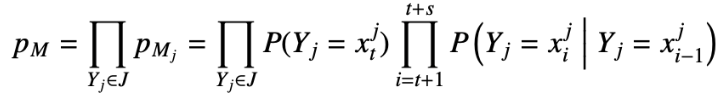
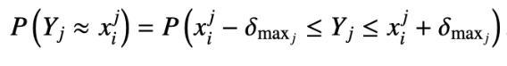
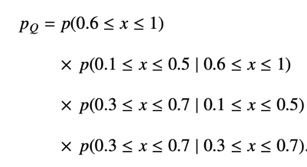

# Cutting Through the Noise: Explaining Residuals in Multivariate Time Series with Motif Analysis

This repository contains the code and experiments for the paper:
"Cutting Through the Noise: Explaining Residuals in Multivariate Time Series with Motif Analysis"
by Miguel G. Silva, Sara C. Madeira, and Rui Henriques.

## Appendix - Motif Statistical Significance Assessment

Given a multivariate time series:
- Motifs are assessed using **Markovian assumptions** between observations.
- **Binomial testing** is used to evaluate whether motif recurrences are statistically significant.
- Approximate matching is supported by setting a **per-variable deviation tolerance** (𝛿ₘₐₓ).

**Probability Model:**

For a motif $M$ spanning $q$ variables, its occurrence probability $p_M$ is estimated as:

where:
- $J$ is the set of variables,
- $p_{M_j}$ is the probability of a motif subsequence in variable $j$.

If approximate matches are allowed:

---

## Worked Example

This example illustrates how to compute the p-value of a discovered motif.

### Problem

- **Time Series:** univariate, Z-normalized
- **Motif:** `[0.8, 0.3, 0.5, 0.5]`
- **Allowed Deviation:** $\delta_{\max} = 0.2$
- **Length of Series:** $n = 100$

### Steps

1. **Estimate $p_M$:**  
   Using the standard normal CDF and first-order Markov assumption, compute the joint probability of the subsequence within the allowed tolerance ranges:

   

3. **Number of Trials:**  
   Possible subsequence starting points:  
   $N = n - s + 1 = 97$
   (where $s$ is the size of the motif)

4. **Compute p-value:**

   Assuming this series follows a standard normal distribution $\mathcal{N}(0,1)$ under a Z-normalization scenario, and given a residual series of length $n=100$, with the given motif $M$ first occurring at position 10, then the probability of observing a similar motif with at least five matches is 2.2E-16, a considerably low likelihood against a reference threshold, $\alpha$=1E-03, attesting its **statistically singnificance**.

If you're interested in a more general and powerful framework for evaluating the statistical significance of motifs (across arbitrary multivariate time series and variable types), check out our other work:

- [**msig**: Statistical framework for evaluating the significance of motifs with arbitrary multivariate order, accommodating different variable types.](https://github.com/MiguelGarcaoSilva/msig)

The `msig` repository provides an in-depth framework and additional methods for motif significance evaluation across multiple settings.

